<div align="center">

# Espace de travail DiagOps

**Productions apprenant · Atlas / CISIA · Session S04**

[](#parcours)
[](#parcours)
[](../data_pack/)

*Un module = un dossier `work/MN/` versionné — jamais de copie du data pack.*

</div>

---

## À quoi sert ce dossier

| Dépôt | Contenu | Rôle |
|-------|---------|------|
| `upstream` | Briefs, starters, `data_pack/`, tools | Cours (lecture) |
| `origin` / rendu | **`work/M0` … `work/M7`** | Votre production |

```text
S04 (cours)                      work/ (vous)
├── M0/ … M8/   briefs           ├── M0/ … M7/   livrables
├── data_pack/  ←─────────────── │   chemins relatifs uniquement
└── tools/init_module.py  ──►    └── initialisation sans écrasement
```

> Le formateur ne publie pas dans `work/`. Fusionner `upstream` ne doit pas écraser vos preuves.

---

## Démarrage

```bash
# Racine du dépôt S04
python3 tools/init_module.py M6   # refuse si le dossier existe déjà
cd work/M6
python3 -m venv .venv && source .venv/bin/activate
python3 -m pip install -r requirements.lock   # ou requirements.txt (M0)
python3 -m pytest -q                          # si présent
```

| Règle | Détail |
|-------|--------|
| Venv | **Un par module** |
| Données | `../../data_pack/...` — jamais copiées ici |
| Secrets | `.env` local + `.env.example` versionné |
| Git privé | [GIT_WORKFLOW.md](../GIT_WORKFLOW.md) |

---

## Parcours

```mermaid
flowchart LR
  M0[M0 API] --> M1[M1 LoRA]
  M1 --> M2[M2 Qualité]
  M2 --> M3[M3 Multisource]
  M3 --> M4[M4 RAG·Agent]
  M4 --> M5[M5 Deploy]
  M5 --> M6[M6 Feedback]
  M6 --> M7[M7 Archi]
  style M0 fill:#dbeafe,stroke:#1d4ed8
  style M1 fill:#dbeafe,stroke:#1d4ed8
  style M2 fill:#fef3c7,stroke:#d97706
  style M3 fill:#fef3c7,stroke:#d97706
  style M4 fill:#d1fae5,stroke:#059669
  style M5 fill:#ede9fe,stroke:#7c3aed
  style M6 fill:#ede9fe,stroke:#7c3aed
  style M7 fill:#ffedd5,stroke:#ea580c
```



| | Module | Focus | Décision / statut | README |
|---|--------|-------|-------------------|--------|
| 01 | **M0** | API diagnostic + UI | Intégration HF / local | [M0/](M0/) |
| 02 | **M1** | Fine-tune LoRA | Prolonger (smoke Mac) | [M1/](M1/) |
| 03 | **M2** | Qualité & quarantaine | Pipeline + audit | [M2/](M2/) |
| 04 | **M3** | Capteurs + BDD | Transmission M4 | [M3/](M3/) |
| 05 | **M4** | Modèle · RAG · agent | Adopter sous conditions | [M4/](M4/) |
| 06 | **M5** | Gates · deploy · rollback | Référence préprod | [M5/](M5/) |
| 07 | **M6** | Agent outils · feedback | **Prolonger** candidat | [M6/](M6/) |
| 08 | **M7** | Architecture · migration | **Différer** effets réels | [M7/](M7/) |

---

## Design commun des README modules

Chaque `MN/README.md` suit la même trame :

1. **En-tête** — titre, badges, une phrase  
2. **Objectif** — ce que le module démontre  
3. **Statut** — décision et preuves  
4. **Démarrage** — venv + install  
5. **Données** — chemins `data_pack`  
6. **Carte** — dossiers utiles  
7. **Vérifier** — commandes de non-régression  
8. **Preuves** — liens vers docs / results  
9. **Suite** — module suivant  

---

## Bonnes pratiques

| Faire | Éviter |
|-------|--------|
| Journaliser dans `journal_bord.md` | Commiter `.env` / tokens |
| Pointer `data_pack/` | Dupliquer le data pack |
| Conserver empreintes / gels | Régler sur un test scellé |
| Un axe de candidat à la fois (M6+) | Promotion automatique |

---

## Liens

| Ressource | Lien |
|-----------|------|
| Cursus | [README racine](../README.md) |
| Git | [GIT_WORKFLOW.md](../GIT_WORKFLOW.md) |
| Data | [data_pack/](../data_pack/) |
| Doc HTML | [Documentation/](../Documentation/) |

---

<div align="center">

**DiagOps S04** — de l’API au contrôle d’architecture  
*README unifié · 2026-10-06*

</div>
